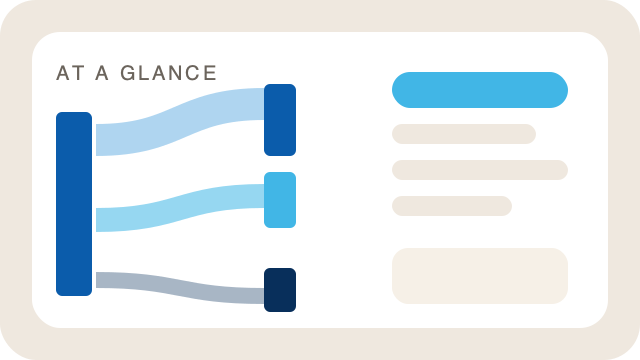
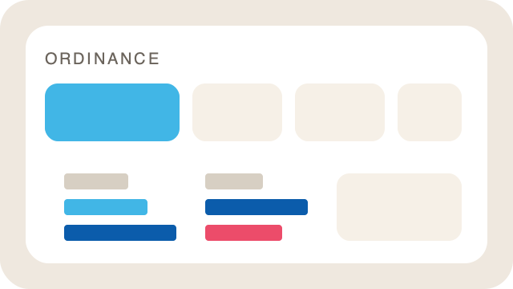

<p align="center">
  
</p>

<p align="center">
  
  
  
  
</p>

<p align="center">
  <a href="dashboard.html"><strong>Open the dashboard</strong></a>
  ·
  <a href="dashboard.html#glance">At a glance</a>
  ·
  <a href="dashboard.html#explore">Ordinance</a>
  ·
  <a href="START_HERE.html">Setup guide</a>
</p>

<p align="center">
  
</p>

A two-page explorer of Chicago’s adopted budget. **Double-click `dashboard.html`** — no install, no server. Keep that file next to the `src/` folder so styles and scripts load.

Headlines, takeaways, filters, and year-over-year marks are built from the data. Refresh the CSVs and the UI updates.

---

## Cloned from GitHub?

This repo includes cached budget files and a built `dashboard.html`, so you can **open the dashboard right away** — no sign-up, no `.env`, no Python.

You **do** need your own credentials if you want to **pull fresh data** from the city (`python3 run.py --refresh`). Those secrets are **not** in the repo; each person sets up their own local `.env` file.

### 1. Create a Chicago Data Portal account

1. Go to **[data.cityofchicago.org](https://data.cityofchicago.org/)** and sign up for a free account (or sign in if you already have one).
2. While signed in, open **[Developer Settings](https://data.cityofchicago.org/profile/edit/developer_settings)**.
3. Create a new **App Token**, copy it, and keep it handy.

Use the **same email and password** you use to sign in to the portal for the username and password fields below.

### 2. Create your local `.env`

From the project root (the folder that contains `run.py`):

```bash
cp .env.example .env
```

Edit `.env` and fill in:

| Variable | Value |
|---|---|
| `SOCRATA_APP_TOKEN` | App token from Developer Settings |
| `SOCRATA_USERNAME` | Your portal login email |
| `SOCRATA_PASSWORD` | Your portal login password |

**Never commit `.env`.** It stays on your machine only. See [`.env.example`](.env.example) for optional dataset overrides.

### 3. Refresh and rebuild

```bash
python3 run.py --refresh
```

Step-by-step setup (Python install, new budget years): **[START_HERE.html](START_HERE.html)**.

---

## Start here

1. **Look.** Open [dashboard.html](dashboard.html). That’s the whole product.
2. **Click around.** At a glance is the river. Ordinance is the vote. Press <kbd>1</kbd> and <kbd>2</kbd> to switch. Press <kbd>J</kbd> to jump to a department.
3. **Only if you need new numbers.** Python is for rebuilds and portal downloads — not for reading the dashboard.

```bash
python3 run.py              # rebuild from cached files and open
python3 run.py --no-open    # rebuild only
python3 run.py --refresh    # download from the city, then rebuild
```

`./run.sh` is the same as `python3 run.py`.

---

## The two pages

<table>
<tr>
<td width="50%" valign="top">

<p align="center"></p>

### At a glance

The official all-funds map. Where the money starts, which pot it sits in, and which city function it pays for.

Click a takeaway or a bar — the rest of the river fades.

</td>
<td width="50%" valign="top">

<p align="center"></p>

### Ordinance

The file City Council passed. Who got what, what moved from the mayor’s draft, and where the money is supposed to come from.

White is the ask. Blue is the vote. Red is a cut.

</td>
</tr>
</table>

| Key | What it does |
| :---: | :--- |
| <kbd>1</kbd> | At a glance |
| <kbd>2</kbd> | Ordinance |
| <kbd>J</kbd> | Jump to a department |
| <kbd>Esc</kbd> | Clear the focus |

---

## Update the numbers

<details>
<summary><strong>Refresh this year’s files from the Data Portal</strong></summary>

<br>

See **[Cloned from GitHub?](#cloned-from-github)** above for sign-up, app token, and `.env` setup. Quick recap:

1. Sign up at [data.cityofchicago.org](https://data.cityofchicago.org/), create an app token in [Developer Settings](https://data.cityofchicago.org/profile/edit/developer_settings).
2. `cp .env.example .env` and add `SOCRATA_APP_TOKEN`, `SOCRATA_USERNAME`, `SOCRATA_PASSWORD`.
3. Pull the latest files and rebuild.

   ```bash
   python3 run.py --refresh
   ```

</details>

<details>
<summary><strong>Point the dashboard at a new budget year</strong></summary>

<br>

1. Set `BUDGET_YEAR` and the three dataset IDs in `.env` or [`src/pipeline/config.py`](src/pipeline/config.py).
2. Optionally paste official Budget Overview totals into [`src/pipeline/published_glance.py`](src/pipeline/published_glance.py) if you want the published net figure (the $16.6B-style number after transfers). Skip this and the glance page is built from the ordinance file alone.
3. Map any new department names in [`src/pipeline/classifications.py`](src/pipeline/classifications.py). Unmapped offices show up as **Other**.
4. Run:

   ```bash
   python3 run.py --refresh
   ```

The glance page then rewrites its headline, insight cards, filter chips, department jump list, and source links from the new files.

</details>

---

## What’s in the folder

```text
Chicago_Budget_Dashboard/
├── dashboard.html          ← open this
├── README.md
├── START_HERE.html         ← click-through setup
├── run.py  /  run.sh       ← rebuild or refresh
├── .env.example            ← copy to .env for portal credentials
├── docs/                   ← banner and page art
└── src/
    ├── app.css             styles
    ├── glance.js           the river
    ├── dashboard.js        pages, jump, charts
    ├── build_dashboard.py  writes dashboard.html
    ├── data/               cached CSVs
    ├── pipeline/           download → clean → payload
    └── notebooks/          exploratory notes
```

More on the source tree: [`src/README.md`](src/README.md).

---

## Share it

Send the whole folder, or the four files that make the page run:

```text
dashboard.html
src/app.css
src/dashboard.js
src/glance.js
```

The other person can open `dashboard.html` immediately. Include this README (or `START_HERE.html`) if they may need to refresh data later.

---

## Sources

<p align="center">
  <a href="https://www.chicago.gov/content/dam/city/depts/obm/supp_info/2026Budget/2026%20Budget%20Overview.pdf"></a>
  <a href="https://data.cityofchicago.org/d/6694-f78c"></a>
  <a href="https://data.cityofchicago.org/d/axxr-vais"></a>
  <a href="https://data.cityofchicago.org/d/nydj-5nax"></a>
</p>

An appropriation is permission to spend, not a receipt. Money also moves between funds, and some spending is paid with grants or leftover balances.

<p align="center">
  
</p>
